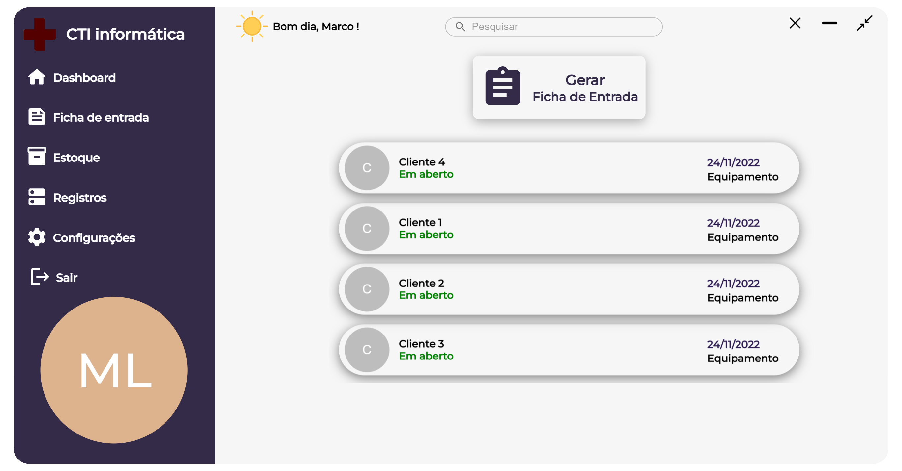

<h1 align="center">CTI App (Desktop)</h1>

    

<h1 align="center">
    <a href="https://github.com/MarcoLGP/cti-app-public">🔗 Versão mobile</a>
</h1>

🚀 Versão desktop proposta do sistema de gerenciamento da empresa CTI Informática

Tabela de conteúdos
=================
<!--ts-->
   * [Sobre](#Sobre)
   * [Ficha de entrada](#Ficha-de-entrada)
   * [Estoque](#Gerencionamento-de-estoque)
   * [Registro](#Registro)
   * [🚧Código legado🚧](#Codigo-legado)
<!--te-->

<h1 id=="Sobre">Sobre</h1>

Projeto possui o propósito de organizar, auxiliar, automatizar e sistematizar o dia-a-dia da empresa, visando substituir o legado papel e caneta.

O sistema possui as funções de: cadastro e consulta de estoque através do código de barras, ficha de entrada através de Qr Code, nota fiscal de venda e serviço, cadastro de funcionários e o registro que salva todas as informações para consulta posteriormente.

<h1 id="Ficha-de-entrada">Ficha de entrada </h1>

A ficha de entrada é gerada através do sistema desktop com os dados do aparelho de entrada, defeito e do cliente, após alimentar o sistema com essas informações é enviado um e-mail para o cliente com o Qr code que será lido pelo App de celular e mostrará as informações referentes aos dados informados.

Após aprovado, será enviado para o registro do sistema todas as informações para futuras consultas.

<h1 id="Gerencionamento-de-estoque">Gerencionamento de estoque</h1>

Os produtos para serem registrados no sistema é necessário ler o Qr code do mesmo e caso não seja registrado será gerada uma tela para alimentar informações do mesmo, caso seja, poderá consulta-lo, através de busca no sistema ou pela leitura do Qr code.

<h1 id="Registro">Registro</h1>

Onde é armazenado o grosso das informações do sistema: Fichas de entradas finalizadas, vendas e serviços finalizados.

<h1 id="Codigo-legado">🚧 Código legado 🚧</h1>

O código do sistema não deve em hipótese alguma ser exemplo de referência ou copiado, a construção do sistema teve propósito didático, meus projetos mais recentes possuem um código mais limpo e um pouco mais encaixado nas boas práticas, este foi o meu primeiro projeto com apenas 2 mêses de teoria.
